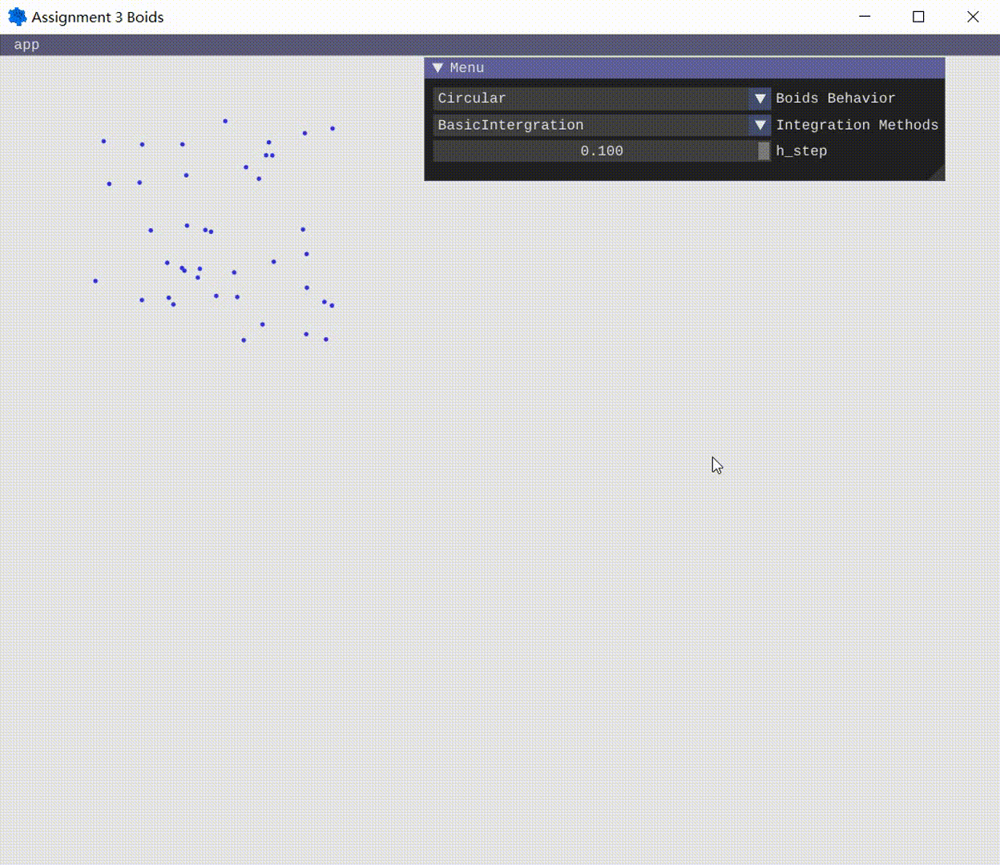
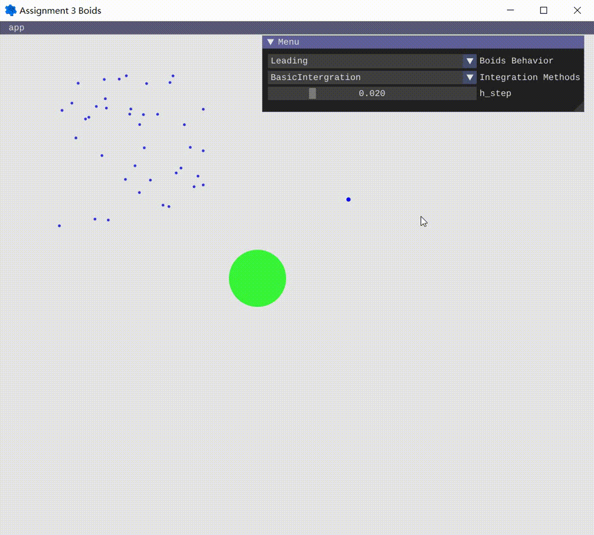
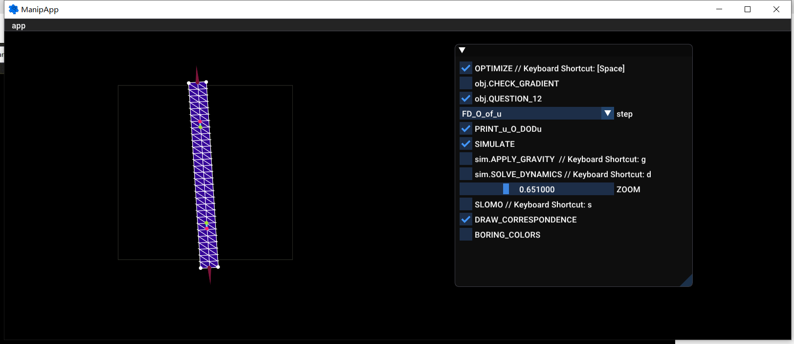
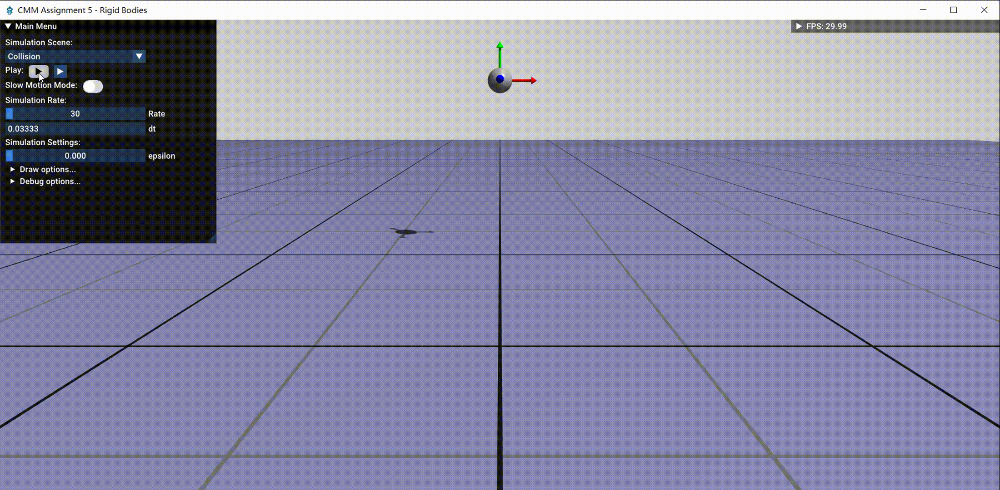
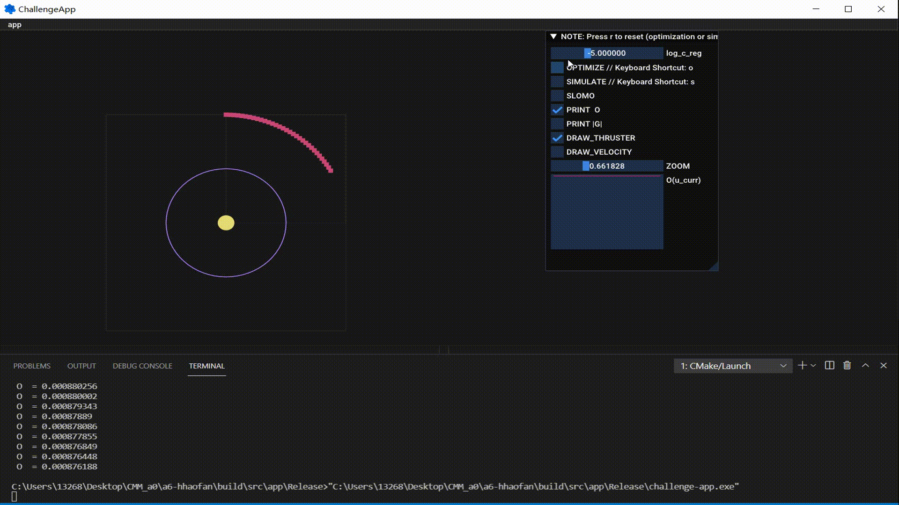

# CMM21-Projects-Overview
This is a brief introduction to the projects I have done in the CMM course, given by ETH CRL group. All of the projects were written in C++.
The most interesting contents of each project is listed below:

* Boids simulation
* Soft body simulation and control
* Rigid body dynamics
* Trajectory Optimization

## 1.  Boids simulation
In this task, I simulate the Boids(Bird-oid objects) system with a self-written GUI interface using ImGui package. The main parts realized in this task are: 
* The realization of the basic kinematics intergration feature, with the consideration of the different intergration methods (Sympletic Euler, Forward Euler, and Explicit Midpoint).
* The realization of different flocking features, including cohesion, alignment, seperation and leader following.

Here is the demo.

*Figure 1: Different intergration methods simulations, using circular motion as an example*

*Figure 2: Flocking-feature simulations with a leading bird. Simulated with basic PI controller*

## 2. Soft body simulation and control
In this task, both forward and inverse problem is simulated with an elastic bar. 
* Forward Problem: When dragging the boundary point of the bar, the whole body of the bar will deformed correspondingly based on the Neo-Hookean Material assumption.

* Inverse Problem: When assigning an arbitary target to specific points in the bar, the handle(boundary) of the bar will find a possible position automaticly  

 By formulating the problem as a constrained optimization problem, and using different numerical solutions to find the numerical solution, this problem can be solved.

*Figure 3: The forward fem simulation*

*Figure 4: The inverse manipulation problem. After adding the regularizer term (click obj.Question_12), it will converge very slowly to the optimal condition.*

It is noticed that at the end of the inverse problem demo, the end of the bar is in some wired position, this can be attributed to the fact of the nonconvexiety of the problem and the property of the optimization method. By adding a regularizer, this problem can be addressed, in spite of slowly processing. The final outcome looks like this.

*Figure 5: The final state of inverse problem*

## 3. Rigid body dynamics
### 3.1 Basic features 

This task attains the feature of rigid body dynamics simulation. Under these three conditions, the motion of a rigid cube/some rigid cubes with some certain mass and MOI is simulated. With the drag of the mouse, the external force can also be added to  the cube.
* Projectile
* Single spring
* Double springs and double cubes 

As you can see in the demo below, the simulation of the dynamics and kinematics process is very well and stable.

*Figure 6: Dynamics of the cube under different situations: 1. Projectile, 2. Single Spring, 3. Double Springs*

### 3.2 Contact simulation
After finishing the basic dynamics simulation, the basics contact simulation is also achieved. By using impluse into integration, setting a criteria of contacting, and setting a restitution coefficient epsilon, the dynamics with contact is simulated. It is noted that the friction is not considered in this task.

*Figure 7: Dynamics simulation with contact under different epsilon of restitution coefficient*

## 4. Trajectory Optimization
In this task, a trajectory optimization problem is attained. To be specific, the following two features are attained.
* Trajectory optimization from point to point, with/ without the disturbance of the gravity from a planet. This task can be attained regardless of the initial velocity and position.
* Trajectory optimization from point to orbit. The satellite can converge to the circular orbit quickly and stably. After that, It can move around the central planet just by the gravity.

*Figure 8: The trajectory optimization problem with and without an added gravity field disturbance. The purple point is the target point and the green ball is the added disturbance planet.

*Figure 9: The trajectory optimization problem to let a satellite fly around a planet just by the planet's gravity 